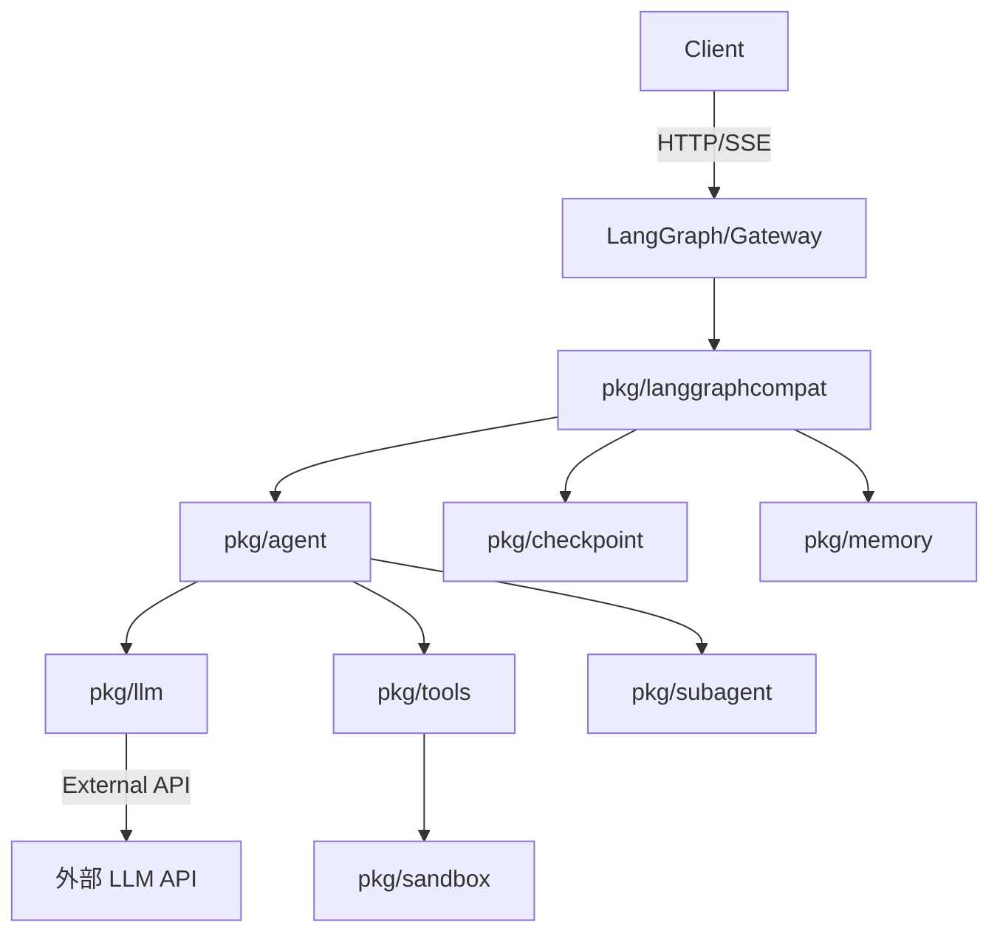

**工作流程教程（入门）**

概述
- 本文档面向初学者，说明从接收一次对话请求到输出最终结果的完整流程，包含上下文建立、LLM 调用、工具调用、沙箱隔离与并发子任务的交互。

快速开始（示例）
1. 准备 `.env`（示例变量见 `.env.example`）。
2. 启动服务：
```
go run ./cmd/langgraph --addr :8080 --model "qwen/Qwen3.5-9B"
```
3. 发送一个最简单的 Run 示例（伪 curl）：
```
curl -X POST http://localhost:8080/runs -d '{"assistant_id":"default","input":{"text":"帮我总结今日要点"}}'
```

端到端流程（逐步说明）
1) HTTP 接入与路由
 - 客户端请求到 LangGraph/Gateway 入口：参考 [cmd/langgraph/main.go](cmd/langgraph/main.go#L1-L120) 与 [pkg/langgraphcompat/compat.go](pkg/langgraphcompat/compat.go#L136-L160)。
 - 网关负责解析 RunCreate 请求，并查找或创建会话/线程。

2) 会话上下文建立
 - 从内存或 `checkpoint`（Postgres）读取历史消息，构建 `[]models.Message` 作为上下文，关键模型类型见 [pkg/models/message.go](pkg/models/message.go#L1-L160)。

3) 创建 Agent 实例
 - 由 LangGraph 层或 Gateway 创建 `agent.Agent`，传入 `LLMProvider`、`tools.Registry` 与 `sandbox`（如有），见 [pkg/agent/react.go](pkg/agent/react.go#L1-L120)。

4) 向 LLM 发起请求（流式/非流式）
 - Agent 将上下文与工具 schema（`tools.List()`）构建为 `llm.ChatRequest` 并调用 `LLMProvider.Stream` 或 `Chat`。
 - 提供者实现位于 `pkg/llm`，Eino 适配器在 [pkg/llm/eino.go](pkg/llm/eino.go#L1-L120)，从环境读取 API Key（`OPENAI_API_KEY`、`SILICONFLOW_API_KEY` 等）。

5) 处理 LLM 返回的工具调用指示
 - 若 LLM 返回 `ToolCall`（或 Agent 决定调用工具），会调用 `tools.Registry.Call` 执行工具，参考 [pkg/tools/registry.go](pkg/tools/registry.go#L1-L160)。

6) 在隔离环境中执行（Sandbox）
 - 需要执行命令或读写文件的工具可在 `Sandbox` 中运行：`sandbox.New` 会尝试 Landlock -> bwrap -> direct，执行见 [pkg/sandbox/sandbox.go](pkg/sandbox/sandbox.go#L1-L160)。

7) 子任务与并发（Subagent）
 - 复杂任务可拆分为子任务并提交给 `subagent.Pool`，池负责并发限制、超时与事件转发，见 [pkg/subagent/pool.go](pkg/subagent/pool.go#L1-L160)。

8) 结果聚合与持久化
 - 工具结果回填为 `ToolResult`，Agent 将其作为消息写回会话。必要时将会话或记忆写入 `pkg/checkpoint`（Postgres）或 `pkg/memory` 存储。

9) 返回客户端
 - 最终生成的文本或事件通过 HTTP/SSE 返回给客户端；LangGraph 会记录 Run 的状态并持久化到 `gateway_state.json`（见 `pkg/langgraphcompat/gateway.go` 的 state 持久化）。

组件职责速查
- `cmd/langgraph` / `cmd/gateway`: 程序入口与服务参数（`--model`、`--addr`）。
- `pkg/langgraphcompat`: LangGraph 兼容层，路由、会话管理、技能/工具发现。
- `pkg/agent`: Agent 主循环与 ReAct 风格决策（核心逻辑在 `Agent.Run`）。
- `pkg/llm`: 抽象 LLM 提供者并实现 Eino 适配器。环境变量控制 API Key 与模型。
- `pkg/tools`: 工具注册与统一调用入口，负责参数校验与执行桥接。
- `pkg/sandbox`: 提供隔离后端（Landlock / bwrap / direct）并封装 Exec/Read/Write。
- `pkg/subagent`: 子代理池与并发任务执行。
- `pkg/mcp`: MCP 客户端（用于连接外部工具进程）。

流程图（Mermaid）


调试建议（小白友好）
- 启动时查看日志：会打印所选 provider 与 model（`cmd/langgraph` 的启动日志）。
- 若工具未执行：在服务内调用对应工具的 Handler（单元测试或临时 main）确认输入校验与 sandbox 权限。
- 若 sandbox 退回 direct：检查系统是否安装 `bwrap` 且内核支持 Landlock；或调整 `SANDBOX_ROOT` 权限。
- 若 LLM 报错：确认 API Key 与 `OPENAI_API_BASE_URL`/`SILICONFLOW_API_KEY` 是否正确。

下步推荐（供参考）
- 阅读 `pkg/agent/react.go` 的 `Agent.Run` 以了解 Agent 的具体决策逻辑。
- 在 `pkg/tools` 添加更多受限的示例工具，练习 schema 校验与 sandbox 调用。
- 如果需要，我可以把本教程生成一个交互式示例（包含一个可运行的本地模拟 LLM + 本地 Postgres 的 docker-compose）。

文档位置: [docs/WORKFLOW.md](docs/WORKFLOW.md)
